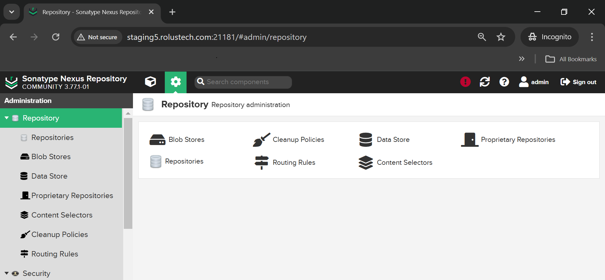
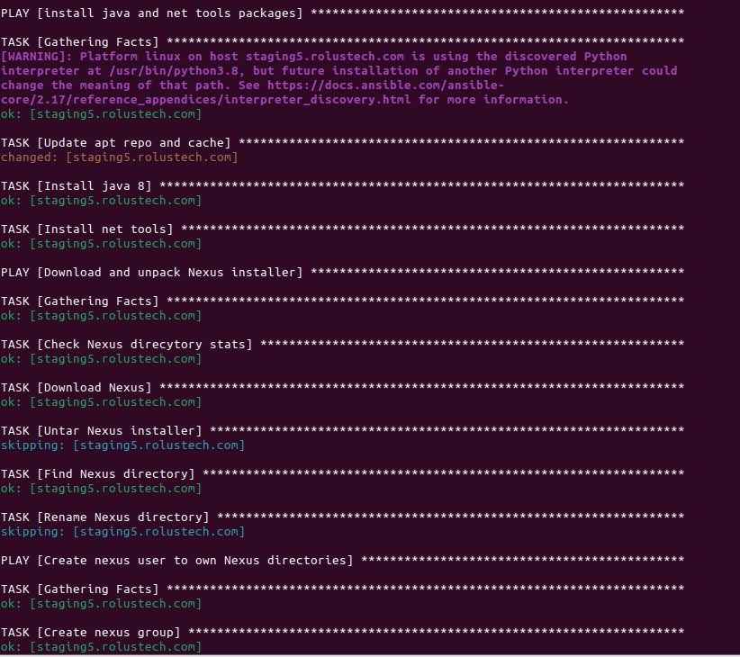
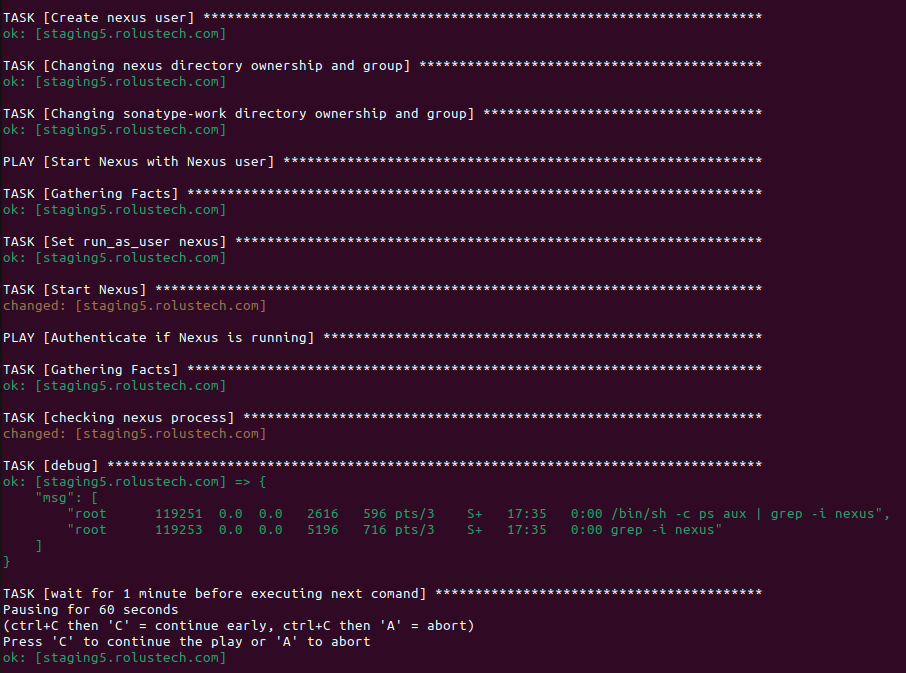
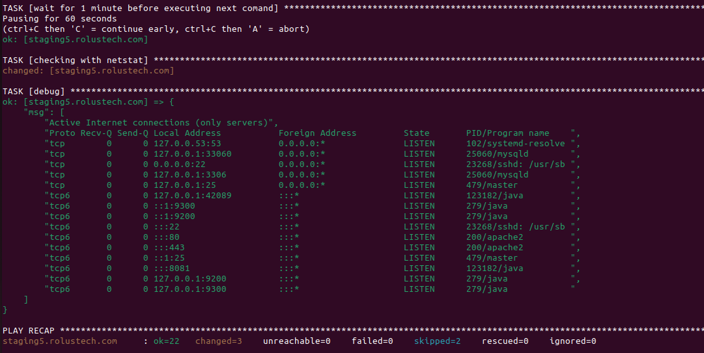

# Ansible Playbook for Nexus Installation and Configuration

This repository contains an Ansible playbook that automates the installation, configuration, and deployment of **Nexus Repository Manager** on a remote server.






### Topics of the Demo Project
Automate Nexus deployment

### Technologies Used
- Ansible
- Nexus
- DigitalOcean
- Java
- Linux

### Project Description
- Create Server on DigitalOcean
- Write Ansible Playbook that creates Linux user for Nexus, configure server, installs and deploys Nexus and verifies that it is running successfully

This Ansible playbook automates the installation of **Nexus Repository Manager** by performing the following tasks:

- Installing **Java 17** and **Net Tools** on the server.
- Downloading and unpacking the **Nexus** installer.
- Creating a **nexus** user and assigning appropriate permissions to Nexus directories.
- Starting the Nexus service and ensuring it is up and running.

## Prerequisites

Before running this playbook, ensure you have the following:

- **Ansible** installed on your local machine.
- **SSH access** to the remote server.
- **Sudo privileges** on the remote server.
- The **nexus_server** defined in your Ansible inventory file.
- A supported Linux distribution (e.g., Ubuntu) running on your server.

#### Steps to create a server on DigitalOcean
Login to your account on [DigitalOcean](https://cloud.digitalocean.com/login) and create a new Droplet (Frankfurt, Ubuntu, Shared CPU, Regular, 4GB / 2CPU). Use the existing SSH key and name it 'ubuntu-ansible-demo-2'. Copy the IP address of the new droplet (104.248.17.245).

## Playbook Breakdown

### First Play: Install Java and Net Tools

This play installs **Java 17** and **Net Tools** on the target server.

- **Task 1**: Update apt cache.
- **Task 2**: Install **Java 17** (`openjdk-17-jdk`).
- **Task 3**: Install **Net Tools** (`net-tools`).

```yaml
- name: install java and net tools packages
  hosts: nexus_server
  tasks:
    - name: Update apt repo and cache
      apt: update_cache=yes force_apt_get=yes cache_valid_time=3600
    - name: Install java 17
      apt: name=openjdk-17-jdk
    - name: Install net tools
      apt: name=net-tools
```

### Second Play: Download and Unpack Nexus Installer

This play downloads the **Nexus Repository Manager** installer and extracts it.

- **Task 1**: Check if the `/opt/nexus` directory exists.
- **Task 2**: Download Nexus from Sonatype.
- **Task 3**: Unpack the downloaded installer.
- **Task 4**: Rename the Nexus directory to `nexus`.

```yaml
- name: Download and unpack Nexus installer
  hosts: nexus_server
  tasks:
    - name: Check Nexus directory stats
      stat:
        path: /opt/nexus
      register: stat_results
    - name: Download Nexus
      get_url:
        url: https://download.sonatype.com/nexus/3/latest-unix.tar.gz
        dest: /opt/
      register: download_result
    - name: Untar Nexus installer
      unarchive:
        src: "{{ download_result.dest }}"
        dest: /opt/
        remote_src: True
      when: not stat_results.stat.exists
    - name: Find Nexus directory
      find:
        paths: /opt/
        pattern: "nexus-*"
        file_type: directory
      register: find_result
    - name: Rename Nexus directory
      shell: mv {{ find_result.files[0].path }} /opt/nexus
      when: not stat_results.stat.exists
```

### Third Play: Create Nexus User and Set Permissions

This play creates the **nexus** user and sets proper file permissions for the Nexus directories.

- **Task 1**: Create a `nexus` group.
- **Task 2**: Create a `nexus` user.
- **Task 3**: Change ownership of the `/opt/nexus` directory and the `sonatype-work` directory to the `nexus` user.

```yaml
- name: Create nexus user to own Nexus directories
  hosts: nexus_server
  become: yes
  become_user: nexus
  tasks:
    - name: Create nexus group
      group:
        name: nexus
        state: present
    - name: Create nexus user
      user:
        name: nexus
        group: nexus
    - name: Change nexus directory ownership and group
      file:
        path: /opt/nexus
        state: directory
        owner: nexus
        group: nexus
        recurse: True
    - name: Change sonatype-work directory ownership and group
      file:
        path: /opt/sonatype-work
        state: directory
        owner: nexus
        group: nexus
        recurse: True
```

## Usage

1. Clone the repository to your local machine:

   ```bash
   git clone https://github.com/awaisdevops/ansible.git
   cd your-repository
   ```

2. Ensure the **nexus_server** is defined correctly in your Ansible inventory file.

3. Run the playbook:

   ```bash
   ansible-playbook -i inventory_file nexus_playbook.yml
   ```

4. The playbook will automatically install **Java 17**, download and unpack **Nexus**, and configure the Nexus service on your remote server.


## License

This project is licensed under the MIT License - see the [LICENSE](LICENSE) file for details.

---
