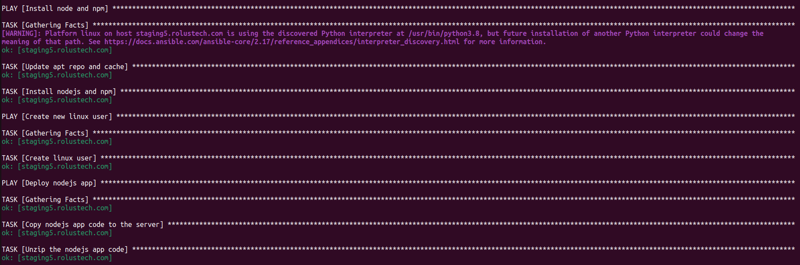
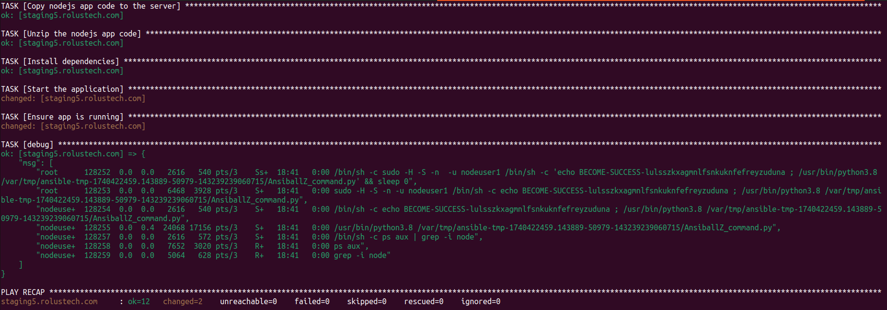

# Ansible Playbook for Node.js Application Deployment

This repository contains an Ansible playbook designed to automate the deployment of a Node.js application on a remote server. The playbook performs three main tasks: installing Node.js and npm, creating a new user for running the Node.js application, and deploying the application code.




## Table of Contents

- [Overview](#overview)
- [Prerequisites](#prerequisites)
- [Playbook Breakdown](#playbook-breakdown)
  - [First Play: Install Node.js and npm](#first-play-install-nodejs-and-npm)
  - [Second Play: Create a New Linux User](#second-play-create-a-new-linux-user)
  - [Third Play: Deploy Node.js Application](#third-play-deploy-nodejs-application)
- [Variables](#variables)
- [Usage](#usage)
- [License](#license)

## Overview

This Ansible playbook automates the following tasks:
1. Installs **Node.js** and **npm** on the remote server.
2. Creates a new Linux user (`nodeuser1`) with sudo privileges to run the Node.js application.
3. Deploys a Node.js application by:
   - Copying the application code to the server.
   - Unzipping the application code.
   - Installing dependencies using npm.
   - Starting the Node.js application asynchronously.
   - Ensuring that the application is running by checking the process list.

## Prerequisites

Before running this playbook, make sure you have:
- Ansible installed on your local machine.
- SSH access to the target server(s).
- A remote server with Ubuntu or a similar Linux-based OS.
- The **`project-vars.yml`** file, which defines the variables for deployment (e.g., the location of the app on the server).

## Playbook Breakdown

### First Play: Install Node.js and npm

This play ensures that **Node.js** and **npm** are installed on the target server. It updates the apt repository cache and installs the required packages:

- **Task 1**: Update apt cache and repositories.
- **Task 2**: Install Node.js and npm.

### Second Play: Create a New Linux User

This play creates a new Linux user, `nodeuser1`, to run the Node.js application securely. The user is added to the `sudo` group, allowing the user to execute commands with elevated privileges if necessary.

- **Task 1**: Create the `nodeuser1` user.

### Third Play: Deploy Node.js Application

This is the core part of the playbook where the Node.js application is deployed:

- **Task 1**: Copy the Node.js app code (zip file) to the server.
- **Task 2**: Unzip the application code.
- **Task 3**: Install the application dependencies with npm.
- **Task 4**: Start the Node.js application asynchronously.
- **Task 5**: Verify that the Node.js application is running by checking the process list.

## Variables

This playbook uses a `project-vars.yml` file to pass the necessary variables, such as the location of the application code on the remote server. Example:

```yaml
location: "/opt/devops/ansible/"
```

## Usage

1. Clone the repository to your local machine:

   ```bash
   git clone https://github.com/awaisdevops/ansible.git
   cd your-repository
   ```

2. Ensure you have the correct server information in your `hosts` inventory file (e.g., the `server_ip_or_hostname`).

3. Create the `project-vars.yml` file with the necessary variables, such as the location to store the app.

4. Run the playbook:

   ```bash
   ansible-playbook -i your_inventory_file playbook.yml
   ```

5. Monitor the output to ensure the application is deployed and running correctly.

## License

This project is licensed under the MIT License - see the [LICENSE](LICENSE) file for details.

```

### Key Notes:
- Replace `your-username` and `your-repository` with your GitHub details in the `Usage` section.
- This `README.md` explains each part of your Ansible playbook in simple terms, allowing others to easily understand what your project does and how to use it.

This should serve as a solid `README.md` for your project! Let me know if you need any changes or additional sections.
