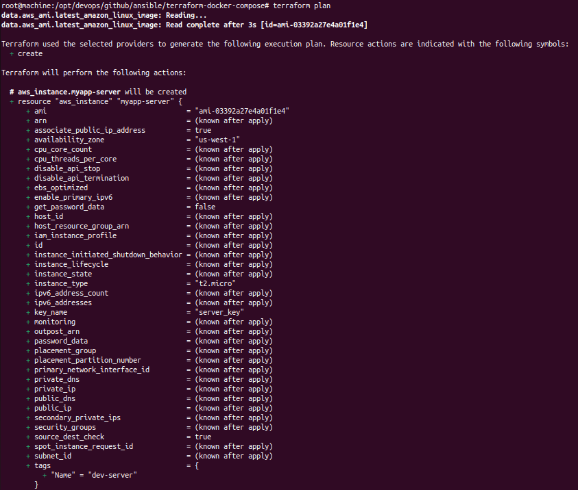

# Terraform AWS Infrastructure Setup

This repository contains a Terraform configuration for provisioning the following AWS resources:



The details of the resources are below:
- **VPC (Virtual Private Cloud)**
- **Subnet**
- **Internet Gateway**
- **Security Group**
- **EC2 Instance**

The resources are provisioned in the `us-west-1` AWS region.

## Requirements

- Terraform version 1.0 or higher
- AWS CLI configured with access to an AWS account
- AWS Region: `us-west-1`

## Terraform Variables

The following variables are used in the configuration:

| Variable                | Description                                                                 | Type   | Default | Example                                  |
|-------------------------|-----------------------------------------------------------------------------|--------|---------|------------------------------------------|
| `vpc_cidr_block`         | CIDR block for the VPC.                                                     | string | N/A     | `10.0.0.0/16`                           |
| `subnet_cidr_block`      | CIDR block for the Subnet.                                                  | string | N/A     | `10.0.1.0/24`                           |
| `avail_zone`             | Availability zone to deploy resources in.                                   | string | N/A     | `us-west-1a`                             |
| `env_prefix`             | Prefix to be used for naming resources.                                     | string | N/A     | `dev`                                    |
| `my_ip`                  | Your public IP address to allow SSH access to the EC2 instance.             | string | N/A     | `203.0.113.0/32`                        |
| `instance_type`          | Type of the EC2 instance to provision.                                      | string | N/A     | `t2.micro`                               |
| `public_key_location`    | Path to the SSH public key used for EC2 access.                             | string | N/A     | `/path/to/your/public/key.pub`          |

## Project Structure

- `main.tf`: Contains the Terraform configuration for AWS resources.
- `variables.tf`: Contains the definitions for all variables.
- `outputs.tf`: Contains output values for your resources.

## What This Code Does

This Terraform configuration defines and provisions the following AWS resources:

1. **VPC (Virtual Private Cloud)**: 
   - Creates a VPC with a specified CIDR block. This VPC will be the network in which all the resources are created.
   
2. **Subnet**: 
   - A subnet is created within the VPC to allocate a range of IP addresses for the resources within that subnet. You can configure it to be in a specific availability zone.

3. **Internet Gateway**: 
   - An internet gateway is created and attached to the VPC, enabling communication between resources inside the VPC and the outside internet.
   
4. **Route Table and Route Table Association**: 
   - A route table is created with a default route to the internet gateway (`0.0.0.0/0`), and this route table is then associated with the subnet to allow outbound internet traffic from resources inside the subnet.

5. **Security Group**: 
   - A security group is defined to control inbound and outbound traffic to the EC2 instance. It:
     - Allows SSH access (port 22) only from the IP address specified in the `my_ip` variable.
     - Allows HTTP (port 80), HTTPS (port 443), and a custom application port (8080) from anywhere (`0.0.0.0/0`).
     - Allows all outbound traffic (`egress`).
   
6. **EC2 Instance**: 
   - An EC2 instance is provisioned using the latest Amazon Linux 2 AMI. The instance is launched in the specified subnet with a public IP address, and it uses the security group and SSH key pair for access.

7. **SSH Key Pair**: 
   - A new SSH key pair is created and linked to the EC2 instance to enable secure access using SSH.

8. **AMI Data Source**: 
   - The configuration fetches the latest Amazon Linux 2 AMI ID dynamically, ensuring the EC2 instance always uses the most recent image.

## Setup Instructions

Follow these steps to set up and deploy your AWS infrastructure:

### 1. Clone the Repository

Clone the repository to your local machine:

```bash
git clone https://github.com/awaisdevops/ansible.git
cd <repository-directory>
```

### 2. Initialize Terraform

Run the following command to initialize the Terraform working directory:

```bash
terraform init
```

### 3. Set Variables

Create a `terraform.tfvars` file in the project root directory with the following content:

```hcl
vpc_cidr_block = "10.0.0.0/16"
subnet_cidr_block = "10.0.1.0/24"
avail_zone = "us-west-1a"
env_prefix = "dev"
my_ip = "203.0.113.0/32"
instance_type = "t2.micro"
public_key_location = "/path/to/your/public/key.pub"
```

Alternatively, you can pass variables directly in the command line when running Terraform commands.

### 4. Plan the Deployment

Before applying any changes, run:

```bash
terraform plan
```

This will show the execution plan and what resources will be created or modified.

### 5. Apply the Configuration

To provision the infrastructure, run:

```bash
terraform apply
```

Terraform will ask you to confirm the action. Type `yes` to proceed with the creation of resources.

### 6. Verify the Resources

Once the deployment is complete, you can log into the AWS Management Console to verify the following resources:

- **VPC**
- **Subnet**
- **Internet Gateway**
- **Security Group**
- **EC2 Instance**

### 7. Output

After applying the Terraform configuration, the following output variables will be available:

| Output         | Description                                                |
|----------------|------------------------------------------------------------|
| `aws_ami_id`   | The ID of the Amazon Linux AMI used to provision the EC2 instance. |

## Destroy the Resources

If you want to destroy the resources and clean up your AWS environment, run:

```bash
terraform destroy
```

This command will remove all the resources defined in the configuration.

## Notes

- Ensure that you have configured your AWS CLI with proper access credentials.
- The security group allows SSH access (port 22) from your IP address (`my_ip`), as well as HTTP (port 80), HTTPS (port 443), and a custom application port (8080).
- The EC2 instance is provisioned using the latest Amazon Linux 2 AMI in the specified availability zone.
- Make sure your SSH key pair (`public_key_location`) is available for use.

## License

This project is licensed under the MIT License - see the [LICENSE](LICENSE) file for details.
